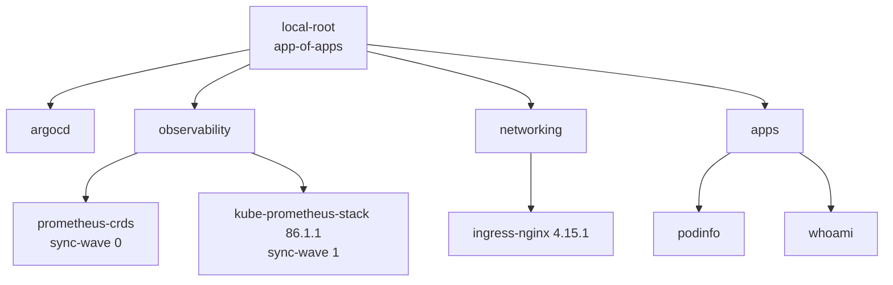

# aegis-gitops

GitOps source of truth for the Aegis local platform. A single ArgoCD root Application (app-of-apps) reconciles everything under `clusters/local`: networking, a Prometheus monitoring stack, and sample workloads with metrics scraping.

The cluster itself is created by [aegis-bootstrap](https://github.com/amanirshad/aegis-bootstrap) (k3d + ArgoCD via Helm).

## Architecture



## Layout

| Path | What it holds |
|---|---|
| `clusters/local/argocd` | `local-root` Application pointing at `clusters/local` (automated sync, prune, self-heal) |
| `clusters/local/observability` | kube-prometheus-stack, with its CRDs split into a separate Application |
| `clusters/local/networking` | ingress-nginx Helm chart with values kept in this repo |
| `clusters/local/apps` | podinfo and whoami: Deployment, Service, Ingress, plus a ServiceMonitor for podinfo |
| `clusters/local/platform` | Reserved for shared platform services (empty, see Roadmap) |

## Design decisions

- **CRDs installed separately, before the chart.** The Prometheus Operator CRDs are too large for client-side apply, so `prometheus-crds` syncs first (sync-wave 0) with `ServerSideApply=true`, and kube-prometheus-stack (wave 1) runs with `crds.enabled=false`. This avoids the annotation size limit and ordering failures on first sync.
- **Pinned chart versions.** Every Helm source pins `targetRevision`, so upgrades are explicit pull requests.
- **Automated sync with prune and self-heal.** Manual changes in the cluster are reverted to what Git says.
- **Observability by default.** Workloads ship a ServiceMonitor next to their Deployment, so a new service is scraped as soon as it syncs.

## Run it locally

```bash
git clone https://github.com/amanirshad/aegis-bootstrap && cd aegis-bootstrap
make bootstrap                      # k3d cluster + ArgoCD
kubectl apply -f https://raw.githubusercontent.com/amanirshad/aegis-gitops/main/clusters/local/argocd/root-application.yaml
kubectl -n argocd get applications  # wait for Synced / Healthy
```

## Roadmap

- [ ] `platform/`: cert-manager, sealed-secrets or External Secrets
- [ ] Policy: OPA Gatekeeper constraints (no privileged pods, approved registries, resource limits)
- [ ] Logs and traces: Loki or EFK, OpenTelemetry Collector, Jaeger
- [ ] CI: kubeconform and `kustomize build` validation on every PR
